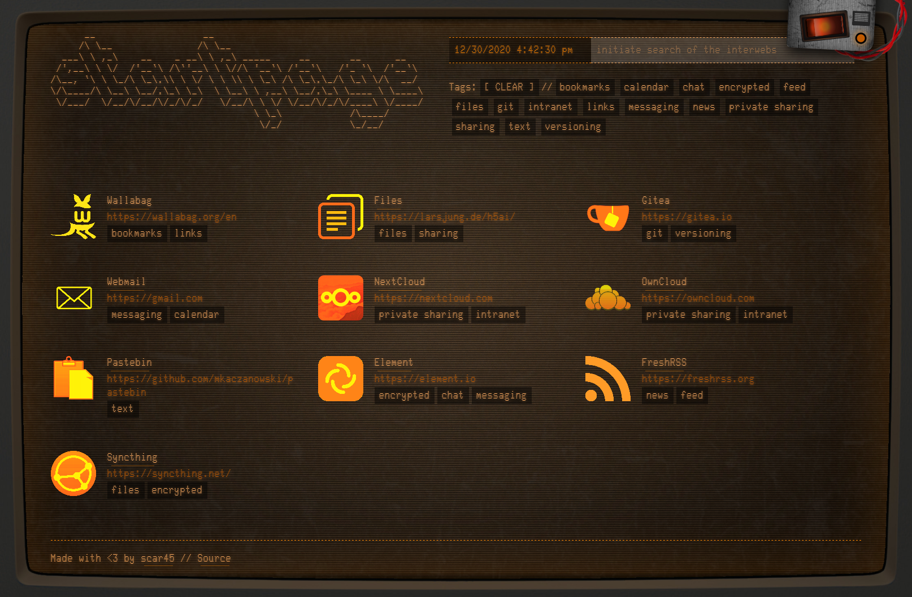
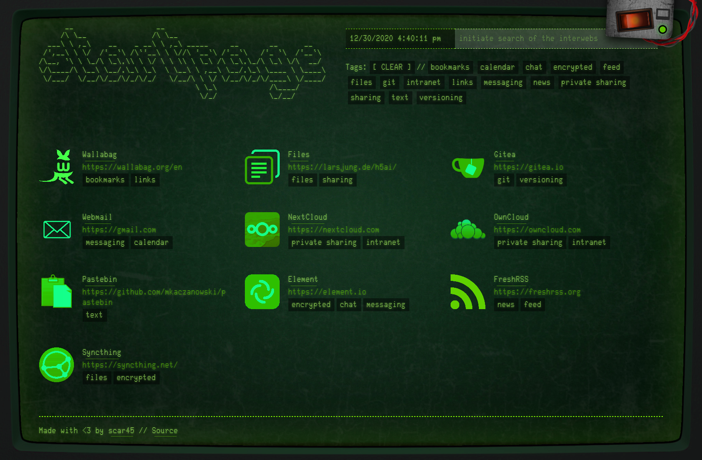

# Retro CRT Startpage
##### by George Merlocco (scar45) @ https://george.merloc.co

---

This repository contains an HTML5-based layout for creating (or using) a personalized startpage with a retro CRT feel.

Interactive example @ http://scar45.github.io/retro-crt-startpage/index.html

[](http://scar45.github.io/retro-crt-startpage/index.html)

[](http://scar45.github.io/retro-crt-startpage/index.html)

## Features

- Links are read in from a JSON file that's easy to update (see ```links.dist.json``` for an example)
- Tag filters
- Search form via DuckDuckGo (can be changed to other search providers if you wish)
- 3 customizable design features toggled via the metal plate in the top-right area:
  - Power On/Off with CRT and sound effects
  - Animated Scanlines/Flicker effect
  - Colour choice between Amber and Green
- Each of the settings above are saved as cookies, so the site will remember the state of what you've enabled/disabled
- Variations of the ASCII header in ```ascii-headers.html```, or generate your own, and paste into the ```<pre class="title">``` tag in ```index.html```
- **NOTE**: The animated scanlines/flicker can be quite CPU intensive. Consider disabling if your system is stressed.

## Editing  ```links.json```

Before working with this file, you'll need to rename the example ```links.dist.json``` to ```links.json```. You can simply start editing the file with a text editor, and modify each link to your liking. Here's an example of valid JSON with two links:
```
{
  "link": [
    {
      "name": "Syncthing",
      "url": "https://syncthing.net/",
      "icon": "icon-syncthing.png",
      "invert": false,
      "tags": [
        "files",
        "encrypted"
      ]
    },
    {
      "name": "NextCloud",
      "url": "https://nextcloud.com",
      "icon": "icon-nextcloud.svg",
      "invert": true,
      "tags": [
        "private sharing",
        "intranet"
      ]
    }
  ]
}
```

| key      | type | description |
| ----------- | ----------- | - |
| name      | string       | Display name of the shortcut |
| url       | string       | URL with http(s)/etc. prefix |
| icon      | string       | Filename of the icon (within `images/icons/`) |
| tags      | array      | List of all associated tags/keywords |

 **NOTE**: As with any JSON, the last node should *not* contain any commas (,) -- This includes the main `link`, and `tags` arrays. Verify this first if you aren't seeing any links.


## Running this startpage

### Traditional web server
 - Apache, nginx, IIS, etc.
 - [Download the latest release](https://github.com/scar45/retro-crt-startpage/releases)
 - Extract the .zip and rename `links.dist.json` to `links.json`
 - Edit `links.json` to contain the links you desire
 - Upload entire local directory to your hosted directory

### Included Node.js http-server
_As of the current time of writing Node.js v10 is required (you can use [NVM](https://github.com/nvm-sh/nvm) to switch Node versions on-the-fly)_
 - Clone the repository, or [download the latest archive](https://github.com/scar45/retro-crt-startpage/archive/master.zip), and rename `links.dist.json` to `links.json`
 - Edit `links.json` to contain the links you desire
 - Run:
   - `npm install`
   - `npm run release`
   - `npm start`
 - Then browse to `http://0.0.0.0:4050` (default port is `4050`, change it in `package.json`)
 - If you wish, you can modify the `PORT` and `HOST` values in `server.js` to run the web server on a different port, IP, etc.
 - Press `CTRL+C` to stop the server

### Docker

Ensure that Docker is installed, then simply run `npm run docker`, which will build the app, and a version-matching, tagged Docker image, then spin up a new container named `retro-crt-startpage` based on that latest image.

Note this task will also create/attach a Docker volume named `retro-crt-startpage_data` mapped to the path `/usr/src/app/build` within the container. This allows you to easily modify `links.json` from your host OS, or even within the container itself as `nano` is installed.

## Developing

If you just wish to use this startpage as your own, then you do not need to read this section. However, if you wish to modify the source (pull requests are encouraged!) then below is a brief outline of how this project has been put together.

## Requirements

- [Node.js](http://nodejs.org)

## Live Coding

**Install dependencies:**
```
npm install
```
...then rename `links.dist.json` to `links.json`, and customize it to your heart's content.

Start a first build, then spawn webserver for live coding (browser-sync):
```
npm run dev
```

This will dump compiled/processed files in a ./build directory, which will then be served by browser-sync, with files being watched for changes. When changes occur, browser-sync will automagically refresh the browser.

[Browsersync](http://www.browsersync.io) is used for live coding (browser-sync) which vastly accelerates development time.

### Releasing

Cleans the `./build` directory, recompiles all sources fresh, excluding unneeded files, and writes a .zip file to `dist/`:

```
npm run release
```
---
...and that's about it! I hope you enjoy this little nostalgic throwback to the terminals of old.

Thanks!

#### Colophon

* [CSS CRT screen effect - Lucas Bebber](https://codepen.io/lbebber/pen/XJRdrV)
* [CSS Scanlines - Mehdi](https://codepen.io/meduzen/pen/zxbwRV)
* [CSS Rocker Switches - Kris Tarling](https://codepen.io/kristarling/pen/WwPovb)
* [Tagsort - Will Haering](https://github.com/wchaering/tagsort)

_.end_
