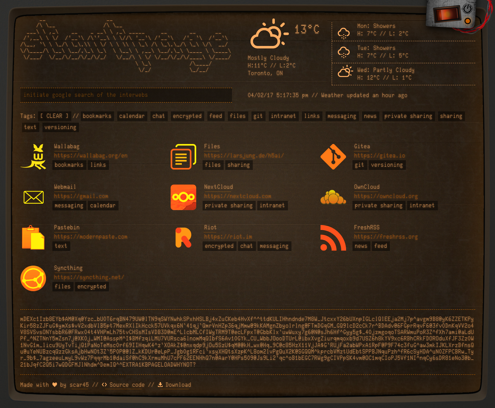

# Retro CRT Startpage
##### by George Merlocco / scar45 @ https://scar45.me

---

This repository contains an HTML5-based layout for creating (or using) a personalized startpage with a retro CRT feel.

Interactive example @ http://scar45.github.io/retro-crt-startpage/index.html

[](http://scar45.github.io/retro-crt-startpage/index.html)

## Features

- Links are read in from a JSON file that's easy to update (see ```links.dist.json``` for an example)
- Tag filters
- Weather support with browser location using jQuery Simple Weather
- Google search form (can be changed to other search providers if you wish)
- 3 customizable design features toggled via the metal plate in the top-right area:
  - Power On/Off with CRT effects
  - Animated Scanlines/Flicker effect (**Note**: Can be CPU-intensive! Consider disabling if your system is stressed)
  - Colour choice between Amber and Green
- Each of the settings above are saved as cookies, so the site will remember the state of what you've enabled/disabled
- Variations of the ASCII header in ```styleguide.html```, or generate your own, and paste into the ```<pre class="title">``` tag in ```index.html```
- **WARNING**: The animated scanlines/flicker can be quite demanding on your CPU

## Editing  ```links.json```

Before working with this file, you'll need to rename the example ```links.dist.json``` to ```links.json```. You can simply start editing the file with a text editor, and modify each link to your liking. Here's an example:
```
    {
      "name": "Syncthing",
      "url": "https://syncthing.net/",
      "icon": "icon-syncthing.png",
      "invert": false,
      "tags": [
        "files",
        "encrypted"
      ]
    }
```
Most are straight forward, however note that the ```icon``` should be a file in ```images/```, as this path gets prepended automatically. ```invert```, if true, will invert the colours of the icon image in the event that it is hard to see otherwise.
 
 **NOTE**: As with any JSON, the last node should *not* contain any commas (,) -- This includes the main ```link```, and ```tags``` arrays. Verify this first if you aren't seeing any links.


## Running this startpage

#### Traditional web server
 - Apache, nginx, IIS, etc.
 - [Download the latest release](https://github.com/scar45/retro-crt-startpage/releases)
 - Extract the .zip and rename ```links.dist.json``` to ```links.json```
 - Edit ```links.json``` to contain the links you desire 
 - Upload entire local directory to your hosted directory
  
#### Included Node.js http-server
 - Requires  [Node.js](http://nodejs.org) to be installed
 - Clone the repository, or [download the latest archive](https://github.com/scar45/retro-crt-startpage/archive/master.zip), and rename ```links.dist.json``` to ```links.json```
 - Edit ```links.json``` to contain the links you desire 
 - Run:
   - ```npm install```
   - ```npm start```
 - Then browse to ```http://127.0.0.1:8080```
 - If you wish, you can modify the ```scripts: {start}``` node in ```package.json``` to pass [extra parameters](https://www.npmjs.com/package/http-server) to ```http-server``` which allows you to run on a different port, use SSL, etc.
 - Press ```CTRL+C``` to stop the server

## Developing

If you just wish to use this startpage as your own, then you do not need to read this section. However, if you wish to modify the source (pull requests are encouraged!) then below is a brief outline of how this project has been put together.

## Requirements

- [Node.js](http://nodejs.org)

## Live Coding

**Install dependencies:**
```
npm install
```
...then rename ```links.dist.json``` to ```links.json```, and customize it to your heart's content.

Start a first build, then spawn webserver for live coding (browser-sync):
```
gulp
```

This will dump compiled/processed files in a ./build directory, which will then be served by browser-sync, with files being watched for changes. When changes occur, browser-sync will automagically refresh the browser.

[Browsersync](http://www.browsersync.io) is used for live coding (browser-sync) which vastly accelerates development time.

### Releasing

Run ```gulp``` with a parameter of ```release``` to clean the ```./build``` directory, recompile all sources fresh, exclude unneeded files, and write a .zip file to ```dist/```:

```
gulp release
```
---
...and that's about it! I hope you enjoy this little nostalgic throwback to the terminals of old.

Thanks!

#### Colophon

* [CSS CRT screen effect - Lucas Bebber](https://codepen.io/lbebber/pen/XJRdrV)
* [CSS Scanlines - Mehdi](https://codepen.io/meduzen/pen/zxbwRV)
* [CSS Rocker Switches - Kris Tarling](https://codepen.io/kristarling/pen/WwPovb)
* [Tagsort - Will Haering](https://github.com/wchaering/tagsort)

_.end_
